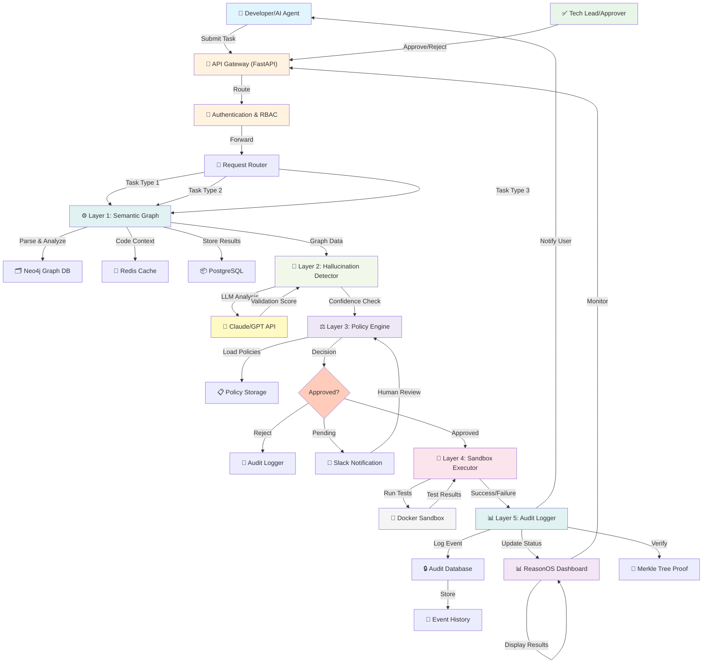

<div align="center">

# 🧠 ReasonOS

**AI Agent Operating System with Governance**

[](LICENSE)
[](https://www.python.org/downloads/)
[](https://nodejs.org/)
[](https://fastapi.tiangolo.com/)
[](https://react.dev/)

[Features](#-key-features) • [Quick Start](#-quick-start) • [Architecture](#-architecture) • [5 Layers](#-the-5-protection-layers)

</div>

---

## 📖 Overview

**ReasonOS** is an **AI Agent Operating System** built for **safe, governed, and auditable AI execution**.  
It prevents hallucinations, enforces enterprise policies, and provides a verifiable audit trail for all AI-driven actions.

Think of it as the **trust layer** between autonomous AI agents and your production systems.

### ❗ The Problem We Solve

- ❌ AI agents hallucinate or generate unsafe code  
- ❌ No governance or human approval workflows  
- ❌ No audit trail for AI decisions  
- ❌ Enterprises face financial risk from AI mistakes  

### ✅ The ReasonOS Solution

ReasonOS implements **5 layers of protection** between AI agents and production codebases:

1. **Semantic Graph** – Understands your entire codebase  
2. **Hallucination Detector** – Validates AI-generated code  
3. **Policy Engine** – Enforces enterprise workflows  
4. **Sandbox Executor** – Tests code safely  
5. **Audit Logger** – Ensures full accountability  

---

## 🎯 Key Features

- **🔍 Semantic Code Understanding** – Tree-sitter parsing + Neo4j knowledge graph  
- **🧠 Hallucination Detection** – LLM-as-Judge validation (GPT/Claude)  
- **⚙️ Policy Enforcement** – YAML-defined governance workflows  
- **🧪 Safe Execution** – Dockerized sandbox for testing  
- **🧾 Immutable Audit Trail** – Merkle tree–based event logs  
- **⚡ Real-time Dashboard** – React + WebSocket updates  
- **🔐 Enterprise Security** – OAuth2, JWT, and RBAC  
- **🐳 Full Containerization** – End-to-end Docker Compose setup  

---

## 🚀 Quick Start

### Prerequisites

- **Python 3.11+** (Backend)  
- **Node.js 20+** (Frontend)  
- **Docker & Docker Compose** (Containerization)  
- **PostgreSQL 15+** (Database)  
- **Redis 7+** (Caching)  
- **Git** (Version control)  

### Installation

```bash
# Clone the repository
git clone https://github.com/hydervali-yalamkur/ReasonOS.git
cd ReasonOS

# Run automated setup
make setup

# Start development environment
make run
```

### Manual Setup

```bash
# 1. Install Python dependencies
cd backend
python -m venv venv
source venv/bin/activate  # Windows: venv\Scripts\activate
pip install -r requirements.txt

# 2. Install Node dependencies
cd ../frontend
npm install

# 3. Configure environment
cp .env.example .env
# Edit your environment variables

# 4. Initialize database
make db-migrate

# 5. Run services
# Backend
cd backend && uvicorn app.main:app --reload

# Frontend (new terminal)
cd frontend && npm run dev
```

### Using Docker

```bash
# Start all services
docker-compose up -d

# View logs
docker-compose logs -f

# Stop services
docker-compose down
```

**Access the application:**
- **Frontend** → http://localhost:3000
- **Backend API** → http://localhost:8000
- **API Docs** → http://localhost:8000/docs

---

## 🏗️ Architecture

ReasonOS follows a **modular, service-oriented architecture** that separates AI reasoning from policy, governance, and execution.  
Every service is independently deployable and communicates via REST and WebSocket APIs.



### 🔑 Key Architecture Components

**1. Frontend (React + Vite)**
- Real-time dashboard for observability, auditing, and policy approval
- WebSocket updates for live status
- Approval workflows with human-in-the-loop
- Visualization of audit logs and sandbox runs

**2. Backend (FastAPI + Celery)**
- Core coordination and governance layer
- Graph Service for code comprehension
- Policy Engine for enforcement
- Sandbox Executor for safe testing
- Audit Logger for immutable history

**3. AI Reasoning Layer**
- Semantic understanding via Tree-sitter
- Hallucination detection via LLM-as-Judge
- Integrations: GPT-4, Claude 3, Azure OpenAI

**4. Data & Knowledge Layer**
- Neo4j for semantic linking and graph queries
- PostgreSQL for durable, auditable data
- Redis for caching and queue states
- Blob storage for artifacts and logs

**5. Infrastructure & DevOps**
- Docker/Kubernetes for scalable deployment
- Terraform for cloud provisioning (Azure)
- GitHub Actions for CI/CD pipelines
- Azure Monitor/Grafana for metrics and alerts

---

## 🧠 The 5 Protection Layers

Each ReasonOS request moves through **five independent layers**, ensuring AI safety, traceability, and policy control.

| Layer | Name | Technology | Purpose | Output |
|:------|:-----|:-----------|:--------|:-------|
| **1** | **Semantic Graph** | Tree-sitter, Neo4j, Pinecone | Parse and map repository context | Dependency & function graph |
| **2** | **Hallucination Detector** | GPT-4/Claude, Type Checkers | Detect unsafe or illogical outputs | Confidence score (0–100) |
| **3** | **Policy Engine** | YAML rules, Python evaluator | Enforce human-in-the-loop governance | `APPROVE` / `REJECT` / `REQUIRES_APPROVAL` |
| **4** | **Sandbox Executor** | Docker, pytest/jest | Test code safely in isolation | Test results & logs |
| **5** | **Audit Logger** | PostgreSQL, Merkle Trees | Immutable event trail | Signed, verifiable logs |

### 🧩 Example Flow

```
Developer: "ReasonOS, refactor this repo"
    ↓
┌───────────────────────────────────┐
│ Layer 1: Semantic Graph           │
│ ✅ Parsed 5 impacted files        │
│ ✅ Found 47 usages               │
└───────────────────────────────────┘
    ↓
┌───────────────────────────────────┐
│ Layer 2: Hallucination Check      │
│ ✅ Validated (Confidence: 92%)    │
│ ✅ 0 hallucinations detected      │
└───────────────────────────────────┘
    ↓
┌───────────────────────────────────┐
│ Layer 3: Policy Enforcement       │
│ ⚖️ Requires Tech Lead Approval    │
│ 📧 Approval request sent          │
└───────────────────────────────────┘
    ↓
┌───────────────────────────────────┐
│ Human Review & Approval           │
│ ✅ Tech Lead approved             │
└───────────────────────────────────┘
    ↓
┌───────────────────────────────────┐
│ Layer 4: Sandbox Execution        │
│ ✅ All 45 tests passed            │
│ ✅ 87% code coverage maintained   │
└───────────────────────────────────┘
    ↓
┌───────────────────────────────────┐
│ Layer 5: Audit Logging            │
│ ✅ Event recorded immutably       │
│ ✅ Merkle proof generated         │
└───────────────────────────────────┘
    ↓
✅ CHANGES MERGED SAFELY TO PRODUCTION
```

---

## 💡 Real-World Example: Multi-File Refactoring

### The Challenge
**Task:** Rename `calculatePrice()` to `computeTotal()` across an entire JavaScript codebase (6 files, 47 usages).

**Without ReasonOS (GitHub Copilot):**
- ❌ Copilot updates 1 file only
- ❌ Misses 46 other usages
- ❌ Code breaks in production
- ❌ No approval trail

**With ReasonOS:**

```bash
$ reasonos refactor rename \
  --old-name calculatePrice \
  --new-name computeTotal \
  --repo ./my-project
```

**Step 1: Semantic Analysis**
```
📊 Repository Scan:
  ✓ 6 files analyzed
  ✓ 18 functions found
  ✓ 47 usages of calculatePrice identified

Module Breakdown:
  🔴 checkout.js (4 usages) - CRITICAL
  🔴 payment.js (8 usages) - CRITICAL
  🟡 invoice.js (3 usages) - SECONDARY
  🟢 tests/checkout.test.js (2 usages) - LOW
  ... [30 more]
```

**Step 2: Hallucination Detection**
```
🧠 Validating AI suggestions:
  ✓ All 47 locations verified
  ✓ 0 hallucinations detected
  ✓ Confidence: 98%
```

**Step 3: Policy Check**
```
⚖️ Policy Evaluation:
  ⚠️ This affects CRITICAL_PATH modules
  ⚖️ Requires approval from: tech_lead, payment_engineer
  📧 Approval requests sent to Slack
```

**Step 4: Human Approval**
```
✅ tech_lead@company.com: APPROVED (16:32:15)
✅ payment_engineer@company.com: APPROVED (16:32:45)
```

**Step 5: Sandbox Testing**
```
🧪 Running tests in sandbox:
  ✓ 35 unit tests PASSED
  ✓ 12 integration tests PASSED
  ✓ Type checking: OK
  ✓ Coverage: 87%
```

**Step 6: Audit Trail**
```
📋 Immutable Record Created:
  • Timestamp: 2025-11-08 16:33:16 UTC
  • User: darby@company.com
  • Changes: 47 locations in 6 files
  • Approvals: 2 (tech_lead, payment_engineer)
  • Tests: 35/35 PASSED
  • Status: DEPLOYED
  • Rollback: Available (git revert abc123)
```

**Result:** ✅ All 47 locations renamed, zero breakage, full audit trail.

---

## 🧪 Testing

```bash
# Run all tests
make test

# Backend tests
make test-backend

# Frontend tests
make test-frontend

# End-to-end tests
make test-e2e

# Coverage report
make coverage
```

---

## 📦 Technology Stack

**Backend:**
- FastAPI (async web framework)
- SQLAlchemy + Alembic (ORM + migrations)
- Celery (task queue)
- Redis (cache/queue)
- PostgreSQL (primary database)
- Neo4j (knowledge graph)
- Anthropic/OpenAI (LLM APIs)

**Frontend:**
- React 18 (UI library)
- Vite (bundler)
- TanStack Query (data fetching)
- Tailwind CSS (styling)
- Zustand (state management)

**Infrastructure:**
- Docker & Docker Compose
- Kubernetes (production)
- Terraform (IaC)
- GitHub Actions (CI/CD)
- Azure Cloud (hosting)

---

## 📋 Table of Contents

- [Overview](#-overview)
- [Quick Start](#-quick-start)
- [Architecture](#-architecture)
- [The 5 Protection Layers](#-the-5-protection-layers)
- [Real-World Example](#-real-world-example-multi-file-refactoring)
- [Testing](#-testing)
- [Technology Stack](#-technology-stack)
- [Contributing](#-contributing)
- [License](#-license)
- [Support](#-support)
- [Team](#-team)

---

## 🤝 Contributing

We welcome contributions! Please see [CONTRIBUTING.md](CONTRIBUTING.md) for guidelines.

```bash
# Fork the repo
git clone https://github.com/YOUR_USERNAME/ReasonOS.git
cd ReasonOS

# Create feature branch
git checkout -b feature/my-feature

# Make changes and test
make test

# Commit and push
git commit -am "feat: add my feature"
git push origin feature/my-feature

# Open a pull request
```

---

## 📄 License

This project is licensed under the **MIT License** – see the [LICENSE](LICENSE) file for details.

---

## 👥 Team

- **Maintainer and Developer:** ([@MotupalliSaiLohith](https://github.com/Motupallisailohith)) 
- **Maintainer and Developer:** ([@HydervaliYalamkur](https://github.com/hydervali-yalamkur)) 
- **Maintainer and Developer:** ([@SafiaShaik](https://github.com/safiashaik04)) 

---

## 🙏 Acknowledgments

- Azure OpenAI for LLM capabilities
- Open-source communities: FastAPI, Neo4j, React
- All contributors and early adopters ❤️

---

## 📞 Support & Community

- **Issues:** [GitHub Issues](https://github.com/hydervali-yalamkur/ReasonOS/issues)
- **Discussions:** [GitHub Discussions](https://github.com/hydervali-yalamkur/ReasonOS/discussions)
- **Email:** info@reasonos.ai
- **Slack Community:** [Join our Slack](https://reasonos.slack.com)

---

## 🗺️ Roadmap

**Q4 2025:**
- ✅ Core 5-layer architecture
- ✅ Semantic graph with Neo4j
- ✅ Hallucination detection
- ✅ Policy engine (YAML-based)
- ✅ Audit logging

**Q1 2026:**
- 🔜 Kubernetes deployment
- 🔜 Multi-cloud support (GCP, AWS)
- 🔜 Advanced analytics dashboard
- 🔜 Webhook integrations

**Q2 2026:**
- 🔜 Mobile app (React Native)
- 🔜 Enterprise SSO (SAML/OIDC)
- 🔜 Custom LLM fine-tuning
- 🔜 GitHub/GitLab native plugins

---

<div align="center">

**Built with ❤️ by the ReasonOS Team**

[⭐ Star us on GitHub](https://github.com/hydervali-yalamkur/ReasonOS) • [🐛 Report Bug](https://github.com/hydervali-yalamkur/ReasonOS/issues) • [✨ Request Feature](https://github.com/hydervali-yalamkur/ReasonOS/issues) • [📧 Email](mailto:info@reasonos.ai)

**Making AI agents safe, governed, and production-ready.** 🚀

</div>